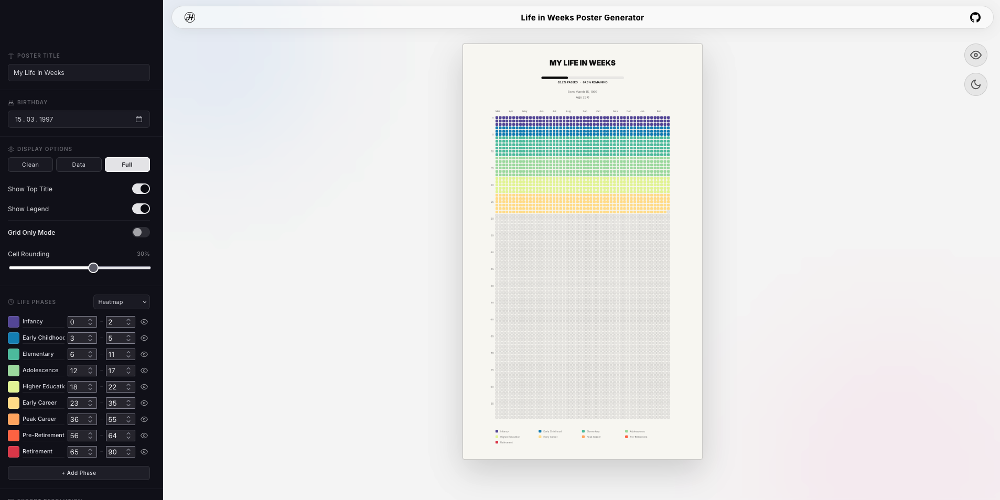

# 🗓️ Life in Weeks — Poster Generator

> Visualize your entire life as a grid of 4,680 weeks. Customize it. Export it. Put it on your wall.

**🔗 [Try it live → julianhilgemann.github.io/lifeinweeks](https://julianhilgemann.github.io/lifeinweeks/)**



[](https://react.dev/)
[]()
[]()
[]()
[]()
[](LICENSE)

---

☕ **Like it? Support the project:**

<a href="https://buymeacoffee.com/julianhilgemann" target="_blank">
  
</a>

---

## What Is This?

Inspired by Tim Urban's [Your Life in Weeks](https://waitbutwhy.com/2014/05/life-weeks.html) — your entire lifespan rendered as a 90×52 grid. Each cell is one week. The colored ones are lived. The black dot is right now. Everything else is ahead of you.

Enter your birthday, pick a color palette, and export a high-resolution poster. That's it.

No account. No server. Nothing leaves your browser.

---

## What You Can Do With It

- **Enter your birthday** and instantly see how far along you are — down to the week
- **Choose from 5 palettes** (Heatmap, Pastel, Basic, B&W, Full Custom) or build your own color scheme per life phase
- **Rename and recolor life phases** — make it yours, not the default
- **Switch between display modes**: full poster with title + legend, data-only, or pure grid
- **Toggle dark / light mode** with a single click — both look great
- **Export as PNG** in five resolutions: HD, 2K, 4K, iPhone Pro wallpaper, or A3 print-ready
- **Preview mode** hides all UI chrome so you see exactly what you're getting before you export
- **Works on mobile** — the full tool, not a stripped-down version

---

## Features at a Glance

| Feature | Detail |
|---|---|
| 🎨 Color palettes | 5 presets + fully custom per phase |
| 🌙 Dark / Light mode | Full re-render, both polished |
| 💎 Glassmorphic UI | Blur, translucency, animated background |
| 📱 Mobile-first | Responsive sidebar → bottom bar |
| 🔭 Preview mode | Full-screen, chrome-free poster view |
| 📤 Export | HD / 2K / 4K / iPhone / A3 — lossless PNG |
| ⚡ Client-side only | No backend, no tracking, instant |

---

## Stack

Single-file React component. Canvas API for rendering. No UI libraries, no backend, no build opinions.

---

## Run Locally

```bash
git clone https://github.com/julianhilgemann/lifeinweeks.git
cd lifeinweeks
npm install
npm run dev
```

---

## Support

Built by [Julian Hilgemann](https://www.julianhilgemann.com).

[](https://buymeacoffee.com/julianhilgemann)

---

MIT License — fork it, ship it.
